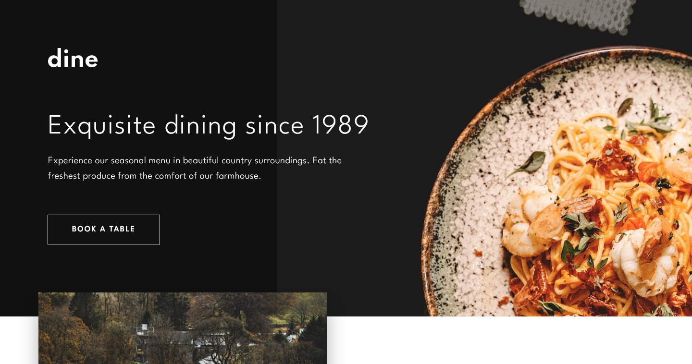
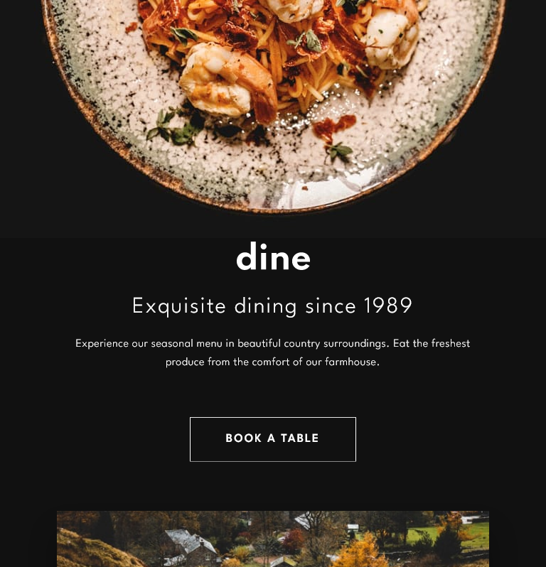
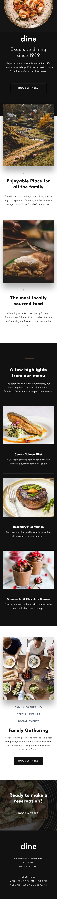
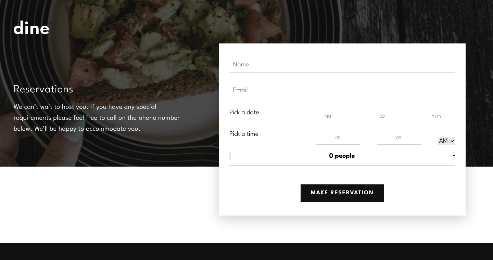
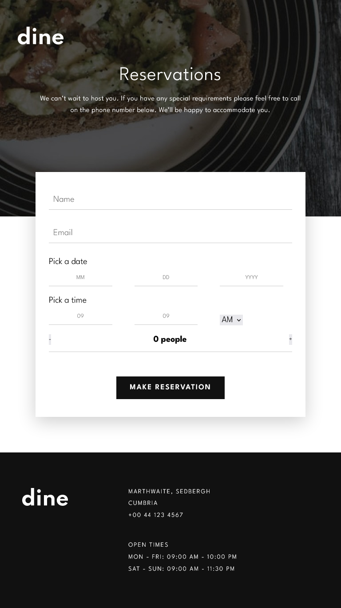
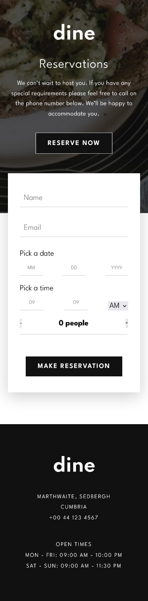

# Frontend Mentor - Dine Website Challenge solution

This is a solution to the [Dine Website Challenge challenge on Frontend Mentor](https://www.frontendmentor.io/challenges/dine-restaurant-website-yAt7Vvxt7). Frontend Mentor challenges help you improve your coding skills by building realistic projects.

## Table of contents

- [Frontend Mentor - Dine Website Challenge solution](#frontend-mentor---dine-website-challenge-solution)
  - [Table of contents](#table-of-contents)
  - [Overview](#overview)
    - [The challenge](#the-challenge)
    - [Screenshot](#screenshot)
    - [Links](#links)
  - [My process](#my-process)
    - [Built with](#built-with)
    - [What I learned](#what-i-learned)
    - [Continued development](#continued-development)
  - [Author](#author)

**Note: Delete this note and update the table of contents based on what sections you keep.**

## Overview

### The challenge

Users should be able to:

- View the optimal layout for each page depending on their device's screen size
- See hover states for all interactive elements throughout the site
- See the correct content for the Family Gatherings, Special Events, and Social Events section when the user clicks each tab
- Receive an error message when the booking form is submitted if:
  - The `Name` or `Email Address` fields are empty should show "This field is required"
  - The `Email Address` is not formatted correctly should show "Please use a valid email address"
  - Any of the `Pick a date` or `Pick a time` fields are empty should show "This field is incomplete"

### Screenshot

### Links

- Solution URL: [Add solution URL here](https://github.com/Nghuynh07/dine_restaurant)
- Live Site URL: [Add live site URL here](https://starlit-sherbet-d852c9.netlify.app/)

## My process

- Started out with some planning for the project: css classes, grouping elements together for layout/styling purposes and write JSX markups.
- Set up folder structures: how many pages are needed? How many components? How and where each component will be nested?
- NPM Install SASS and setting up basic file structures.
- Write SCSS/ Styling and layout include media queries. This took the longest. This is my firs time working with so many images. I think I know why there are so many images. I believe it is intended for lazy loading image. I did not however, but I intended to use the Intersection Observer API to lazy load images. I have worked with this before on my portfolio.
- This is a mobile approach so I started out with 374px mobile device and slowly add complexity for larger screen size.
- I work from top to bottom through the project. One section after another; however, I did jump around to ensure other parts did not break as I work on media queries.
- Lastly was working on the form. Originally I wanted to use the 'date' and 'time' type input;however, I quickly realized that styling 'date' and 'time' only available in chrome, so I had to restart and take another approach. I didn't have to, but I want the project to look as close as possible to the original. It is my first attempt with this project, but it is worth the time.
- Each input is attached to a customHook. For example: name, email input would attach to its own hook. The final result have 7 different hooks for each input. I am absolutely sure there is a better way to approach this with just one hook. It might involve passing in argument as a function into the hook and import from an external file. I couldn't quite figure that out, but I think it might be a good attempt in making the code DRY. Each hook also contains, onFocus, onBlur isBlur and isFocus and error if user did not input the values.
- For this project, I also attempted using picture element with srcSet. I am not sure how good it plays out in the end as I did not attempt lazy loading. But as I was thinking about the intersection observer API, it might be better if element img were used instead of picture. For CSS to toggle hide/show image display: block or display: none might be good.
- I am not entirely happy with how it came out; but I learned quite a bit and I talk about it below. It was definitely a good challenge. It stretched my skill as a front-end developer and I know where I am at with my layout skills. The project suffers a little after tablet layout. I hope with enough practices/projects I can improve this aspect as a front-end developer.

### Built with

- Semantic HTML5 markup
- CSS custom properties
- Flexbox
- CSS Grid
- Mobile-first workflow
- [React](https://reactjs.org/) - JS library

### What I learned

- Initial planning of a project is so crucial. Although I spent a good amount of time planning for the project: folder structure, setting upp css classes for JSP markups, components/pages that the project need, as I work through the project, I constantly having to go back and add a few addition div here and there to group elements together.
- This is my first time trying mobile approach, its a little different than what I normally approach which is desktop first, but I see the benefit of mobile approach. Mobile first is a lot easier to approach than desktop, as it adds lowest level of complexity then gradually increases it as the screen size gets larger. Desktop first is removing the complexity using max-width. I have worked with both and after project, I believe mobile first is the winner for me.
- After writing SCSS for a while now, I realize nesting media queries inside element might be easier than having a separate media partial. Its just easier on the eye and for organizing. Not entirely sure if this might be true for large scale project but with just 2 pages like this project, I can see myself getting lost in media query partial and having to scroll to find the @media.

### Continued development

Use this section to outline areas that you want to continue focusing on in future projects. These could be concepts you're still not completely comfortable with or techniques you found useful that you want to refine and perfect.

**Note: Delete this note and the content within this section and replace with your own plans for continued development.**

## Author

- Website - [Huynh Nguyen](https://huynhtn.com/)
- Frontend Mentor - [@Nghuynh07](https://www.frontendmentor.io/profile/Nghuynh07)
- Twitter - [@huyniewin](https://twitter.com/huyniewin)
